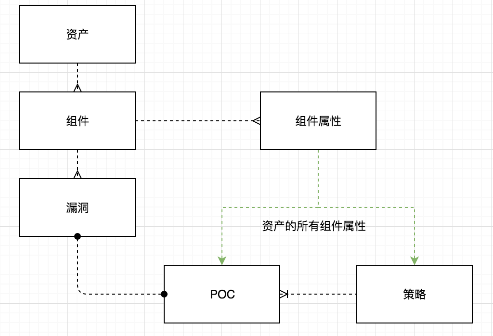

# CScanPoc

CScan Poc 开发文档。

## 接口概述

接口集中在 `CScanPoc.lib.api` 中定义。

- `ABVuln`: 漏洞抽象类
- `ABPoc`: 漏洞验证抽象类
- `ABStrategy`: 策略抽象类
- `Component`: 组件

注意 POC 和 Strategy 中都可以定义执行参数（覆盖 `option_schema` 属性）。其返回值类型见[属性定义]()。

组件的具体定义放在[CScanPoc/CScanPoc/resources/component/](CScanPoc/CScanPoc/resources/component/) 下以 `组件名.json` 的方式命名的文件中。其中定义的格式应该是：

```python
{
  "type": "cms",          # cms | os | middleware | database | device | service | service_provider
  "producer": "",         # 厂商
  "desc": "",             # 描述
  "properties": {}        # 此定义和属性定义中 "properties" 的定义一致
}
```

现在 POC 和 Strategy 都对单个资产进行扫描。它们执行时可以传入执行参数以及资产的属性。看属性定义也可知，执行参数的属性可以引用组件属性，即执行过程中如果某个执行参数没有人工设定，将会自动获取传进来的对应组件的属性。POC 的默认引用组件是其对应漏洞组件。

各对象之间的关系：



## 属性定义

```python
{
  'name': '',            # Schema 名字
  'description': '',     # Schema 描述
  'properties': {        # 属性定义
    'prop_1': {              # 属性名
      'type': 'string',          # 【可选，默认 'string'】属性类型 'string' | 'number' | 'boolean'
      'description': '',         # 【可选】属性描述
      'default': '',             # 【可选】默认值，类型要和 'type' 中定义的一致
      '$default_ref': {          # 【可选】默认值引用
        'component': '',             # 【可选】默认值引用的组件名
        'property': '',              # 默认值引用的组件属性
      }
    }
  }
}
```
